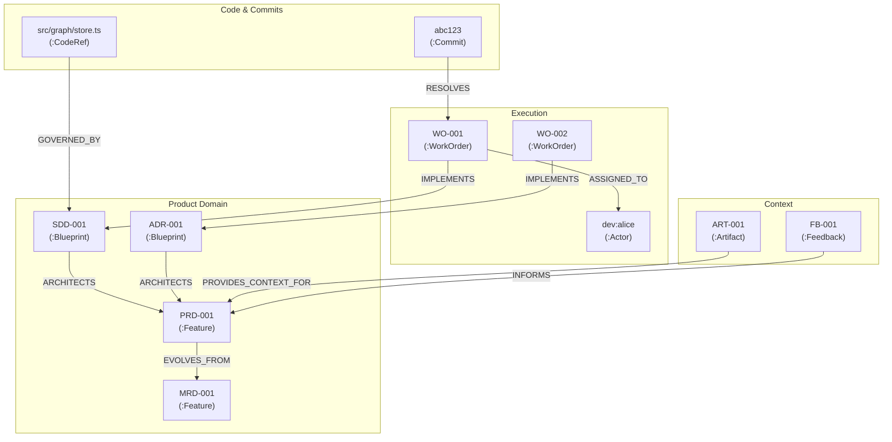

## Contexto

El Product & Context Graph Engine es un sistema que unifica gestión de producto, arquitectura técnica y código fuente. La fuente de verdad son documentos markdown con frontmatter YAML (MRD, PRD, FR, SDD, ADR, WO, ART, FB). Estos documentos se escanean, parsean, indexan en una base de datos de grafos local (Neo4j), y se exponen a asistentes de IA y desarrolladores vía Model Context Protocol (MCP). El sistema detecta desincronización automáticamente (drift), marcando código y Work Orders cuando la arquitectura cambia.

## Stack Técnico

| Componente | Tecnología | Versión | Razón |
|---|---|---|---|
| **Base de datos** | Neo4j Community (Docker) | 2026.08.1 | Índice vivo, APOC para graph algorithms, gratuito, local |
| **MCP oficial** | neo4j-mcp | 1.6.0 | Herramienta oficial Go; read-only por defecto (índice derivado) |
| **MCP data modeling** | mcp-neo4j-data-modeling | 0.8.2 | Validar y exportar modelo de grafo; uvx para instalación limpia |
| **Skill Neo4j** | neo4j-skills (marketplace) | 1.0.1 | Asistencia en modelado, Cypher, CLI, MCP durante desarrollo |
| **Runtime** | Node.js | 20.20.2 | Ambiente del usuario; ESM modules |
| **Lenguaje** | TypeScript | 7.0.2 | Tipado, dev con tsx 4.23.13 |
| **Driver Neo4j** | neo4j-driver | 6.2.0 | `executeQuery`, transacciones, UNWIND batching |
| **MCP SDK** | @modelcontextprotocol/sdk | 1.30.0 | `McpServer`, `StdioServerTransport` |
| **Parser YAML** | gray-matter | 4.0.3 | Frontmatter YAML + body markdown |
| **Validación** | zod | 4.6.3 | Schema zod por tipo de doc (MRD/PRD/SDD/ADR/WO/ART/FB) |
| **Glob files** | fast-glob | 3.3.3 | Scan rápido de docs (.md) ignorando node_modules |
| **CLI** | commander | 14.0.3 | Parser de args, subcomandos (index, sync, lint, metrics, etc.) |
| **Config** | dotenv | 17.4.2 | Variables de entorno desde .env |
| **File watch** | chokidar | 5.0.0 | Watch .md files, CI hook triggers |
| **Git** | git CLI | 2.34 | Procesamiento via `execFile` sin shell (seguro) |
| **Tests** | vitest | 4.1.11 | Unit + integration; vitest/@vitest/coverage-v8 4.1.11 (umbral 80%) |

## Arquitectura

### Flujo General

```
┌─────────────────────────────────────────────────────────┐
│ Documentos .md con frontmatter YAML (git versionado)    │
│ MRD-001, PRD-001, SDD-001, WO-xxx, ART-xxx, FB-xxx       │
└────────────────────┬────────────────────────────────────┘
                     │
                     ▼ prdm index
┌─────────────────────────────────────────────────────────┐
│ Scanner (fast-glob) → Parser (gray-matter + zod)        │
│ GraphNode + GraphEdge + governs (globs/symbols)         │
└────────────────────┬────────────────────────────────────┘
                     │
         ┌───────────┴────────────┐
         │                        │
         ▼                        ▼
    Neo4jGraphStore      Sync Monitor (drift)
    (repository)         (baseline + git log)
         │                        │
         └───────────┬────────────┘
                     │
                     ▼ Neo4j (Docker 127.0.0.1:7687)
         ┌─────────────────────────────────┐
         │ :Node (Feature/Blueprint/WO)    │
         │ :CodeRef {key} :Commit {sha}    │
         │ :Actor rels: EVOLVES_FROM,      │
         │ ARCHITECTS, IMPLEMENTS, etc.    │
         │ Index full-text node_text       │
         └─────────────────────────────────┘
         
         ▲
         │ MCP + CLI
         ├── prdm-graph (Tool: list_work_orders, get_context, claim, complete)
         ├── prdm CLI (index, sync, tree, metrics, feedback add/triage)
         └── Neo4j Browser (7474): visualización interactiva
```

**Patrones:**
- **Doc-as-Code:** .md versionado en git es source of truth; Neo4j = índice reconstruible.
- **Repository:** interfaz `GraphStore` con implementación `Neo4jGraphStore`; lógica de dominio aislada de Cypher.
- **La IA es cliente:** MCP expone herramientas; asistente decide triaje, implementación, acks.

### Componentes Principales

**1. Dominio y Parser (F-01):** `src/domain/`, `src/parser/`
- `domain/schema.ts`: esquemas zod por tipo de documento, labels y tipos de relación permitidos
- `parser/scan.ts`: fast-glob `**/*.md` respetando `ignore`; detecta IDs duplicados
- `parser/frontmatter.ts`: gray-matter + zod → `ParsedDoc` (nodo, aristas, `governs`, actor, `contentHash` que ignora campos volátiles)
- `parser/frontmatter-edit.ts`: reescritura quirúrgica de campos del frontmatter preservando el resto del archivo
- `artifacts/ingest.ts`: ingesta de .txt/.md/.eml/.vtt/.srt/.json → ART-xxx.md con auto-link por full-text

**2. GraphStore (F-02):** `src/graph/`
- `types.ts`: puerto `GraphStore` (repository pattern) y tipos de lectura
- `store.ts`: `Neo4jGraphStore` — snapshot idempotente en una transacción (`MERGE` + etiquetas dinámicas), búsqueda full-text, ramas con `apoc.path.subgraphAll`, contexto de Work Order con subconsultas `COLLECT {}` y métricas
- `migrations.ts`: constraints e índices (`prdm db migrate`)
- `tree.ts`: construcción del Feature Tree y render texto/Mermaid
- `lucene.ts`: consulta Lucene segura (solo términos alfanuméricos)

**3. Sync Monitor (F-03):** `src/sync/`
- `code-refs.ts`: expansión de globs y hash sha256 de archivos o símbolos (`archivo#símbolo`, TS/JS/Python)
- `git.ts`: `git log` → commits con trailers `Refs: WO-xxx` y archivos tocados; `git status` → rutas sucias
- `baseline.ts`: `.prdm/baseline.json` versionado (estado reconocido por el equipo)
- `monitor.ts`: reglas de drift puras (`detectDrift`) y reconocimiento (`acknowledge`)

**4. Engine:** `src/engine.ts` — orquesta scan → governs → git → drift → escritura de estados en frontmatter → baseline → snapshot Neo4j; serializa mutaciones con `transaction()`.

**5. Work Orders (F-04):** `src/workorders/` — `generator.ts` (checklist `## Tareas` → WO-xxx.md, idempotente vía `source_task`), `context.ts` (context bundle), `lifecycle.ts` (claim/complete, registra `blueprint_hashes`).

**6. Feedback (F-05):** `src/feedback/` — `triage.ts` (menciones explícitas o ranking full-text; auto-link con umbral y margen), `ingest.ts` (FB-xxx.md y creación de FR-xxx).

**7. Métricas (§6):** `src/metrics/metrics.ts` — tiempo de resolución de WOs, % de código sincronizado, % de Features y commits trazables.

**8. MCP + CLI:** `src/mcp/` (servidor stdio `prdm-graph`) y `src/cli/` (`prdm`).

## Modelo de Grafo

### Nodos y Propiedades

**`:Node` (label base para todos)**
- `id` (PK): "MRD-001", "PRD-001", "SDD-001", "WO-012", "ART-003", "FB-005"
- `title`: string
- `body`: markdown
- `status`: "draft", "active", "approved", "done", "out_of_sync", "proposed", "new"
- `tags`: [string]
- `tags_text`: tags concatenados (indexables por full-text)
- `source_path`: "docs/mrd/MRD-001.md" (relativo al repo)
- `content_hash`: sha256 del frontmatter estable + cuerpo normalizado (ignora status, asignación y timestamps)
- `ref`: clave uniforme para árboles (`PRD-001`, `code:src/x.ts`, `commit:abc1234`, `actor:agent:claude`)
- `created_at`: ISO date
- `kind`: "MRD" | "PRD" | "FR" | "SDD" | "ADR" | "WO" | "ART" | "FB" (redundante con type, pero cómodo para queries)

**`:Feature` (extends Node)**
- Labels adicionales: `:Feature {kind: MRD|PRD|FR}`
- Propiedades heredadas de `:Node`

**`:Blueprint` (extends Node)**
- Labels adicionales: `:Blueprint {kind: SDD|ADR}`
- `governs`: ["src/sync/**", "src/graph/store.ts#Neo4jGraphStore", ...] (índice invertido en GOVERNED_BY relationships)

**`:WorkOrder` (extends Node)**
- `status`: "todo" | "in_progress" | "done" | "out_of_sync"
- `source_task`: hash(checklist item) para idempotencia
- `assigned_to`, `claimed_at`, `completed_at`, `resolved_by` (shas)
- En el frontmatter (no en el nodo): `blueprint_hashes` {SDD-001: sha256} — hash de cada blueprint al completar el WO

**`:CodeRef` (node, queryable)**
- `key`: "src/graph/store.ts" | "src/graph/store.ts#Neo4jGraphStore" (path + optional symbol)
- `path`, `symbol` (opcional), `hash` (sha256 actual o null si falta)

**`:Commit` (node, queryable)**
- `sha` (unique), `subject`, `author` (nombre git), `date` (ISO), `refs` (WO ids del trailer), `files`

**`:Actor` (node, queryable)**
- `id`: "agent:claude-sonnet" | "dev:alice"
- `kind`: "ai_agent" | "developer"

### Relationships

| From | Type | To | Properties | Use |
|---|---|---|---|---|
| `:Feature` | `EVOLVES_FROM` | `:Feature` | — | Feature tree hierarchy |
| `:Blueprint` | `ARCHITECTS` | `:Feature` | `review_needed: bool` | Architecture decision point |
| `:CodeRef` | `GOVERNED_BY` | `:Blueprint` | `status: "synced"\|"out_of_sync"` | Drift tracking |
| `:WorkOrder` | `IMPLEMENTS` | `:Blueprint` | — | WO to architecture |
| `:WorkOrder` | `ASSIGNED_TO` | `:Actor` | — | Ownership |
| `:Commit` | `RESOLVES` | `:WorkOrder` | — | Commit to WO link |
| `:Artifact` | `PROVIDES_CONTEXT_FOR` | `:Feature` | — | Supporting evidence |
| `:Feedback` | `INFORMS` | `:Feature` | — | User input drives evolution |

### Constraints (DDL)

```cypher
CREATE CONSTRAINT node_id IF NOT EXISTS FOR (n:Node) REQUIRE n.id IS UNIQUE;
CREATE CONSTRAINT coderef_key IF NOT EXISTS FOR (c:CodeRef) REQUIRE c.key IS UNIQUE;
CREATE CONSTRAINT commit_sha IF NOT EXISTS FOR (c:Commit) REQUIRE c.sha IS UNIQUE;
CREATE CONSTRAINT actor_id IF NOT EXISTS FOR (a:Actor) REQUIRE a.id IS UNIQUE;
```

### Indexes

```cypher
// Full-text para triaje de feedback, auto-link de artifacts y search_nodes
CREATE FULLTEXT INDEX node_text IF NOT EXISTS FOR (n:Node) ON EACH [n.title, n.body, n.tags_text];
// Filtros por estado y tipo
CREATE INDEX node_status IF NOT EXISTS FOR (n:Node) ON (n.status);
CREATE INDEX node_kind IF NOT EXISTS FOR (n:Node) ON (n.kind);
```
Los constraints de unicidad ya crean índices de rango sobre `CodeRef.key` y `Commit.sha`.

### Modelo Mermaid



## Detección de Drift

### Reglas

Un documento o archivo gobernado que aparece por primera vez se registra en el baseline como reconocido; uno que desaparece se reporta como `missing` en vez de podarse. Un WO terminado es **vigente** para un blueprint si su `blueprint_hashes[bp]` coincide con el hash actual del blueprint (o, si no lo registró, si el blueprint no cambió respecto al baseline). Un archivo gobernado está **cubierto por commit** si no tiene cambios sin commitear y el último commit que lo toca referencia (trailer `Refs: WO-xxx` o `resolved_by`) a un WO terminado y vigente que implementa ese blueprint; en ese caso el baseline del archivo avanza a su hash actual. Un WO `out_of_sync` solo vuelve a `done` con evidencia explícita: re-completarlo o `prdm sync ack WO-xxx`. Si hay documentos inválidos, el baseline no se guarda (evita aceptar drift en silencio), y todas las mutaciones se serializan con el lock `.prdm/engine.lock`.

**Regla 1: Blueprint cambió vs. baseline**
- Los `:WorkOrder` `done` que no son vigentes pasan a `out_of_sync` (y vuelven a `done` cuando lo son de nuevo); el estado se escribe en su frontmatter.
- Cada `GOVERNED_BY` de ese blueprint queda `out_of_sync` (`reason: blueprint_changed`) salvo que el archivo esté cubierto por commit.

**Regla 2: Código gobernado cambió**
- Si el hash del archivo/símbolo difiere del baseline y no está cubierto por commit → `GOVERNED_BY.status = out_of_sync` (`code_changed`). Un archivo o símbolo inexistente → `out_of_sync` (`missing`).

**Regla 3: Feature cambió (requerimiento evolucionado)**
- Si su hash difiere del baseline → `ARCHITECTS.review_needed = true` en cada blueprint que la arquitecta, y el código gobernado por esos blueprints pasa a `out_of_sync` (`reason: feature_changed`) porque puede haber quedado legado. Se resuelve cuando el arquitecto revisa y ejecuta `prdm sync ack <FEATURE-ID>` (o actualiza y reconoce el blueprint).

Además se reportan enlaces rotos, enlaces a tipos incorrectos (p. ej. `IMPLEMENTS` hacia un PRD) y patrones `governs` que no matchean archivos.

### Workflow de Reconocimiento

```
prdm sync              # Re-indexa y reporta drift
prdm sync --check      # Igual, con exit ≠ 0 si hay errores (CI)
prdm sync ack SDD-001  # Re-baselina el blueprint y su código; sus WOs terminados siguen out_of_sync
prdm sync ack WO-012   # Acepta un WO como vigente sin retrabajo (registra blueprint_hashes)
prdm sync ack all      # Re-baselina todo
```

Workflow post-commit (CI):
```bash
prdm sync --check  # Falla si drift
# (en GitHub Actions, exit ≠ 0 bloquea merge)
```

## Seguridad

- **Cypher:** Parametrizado siempre (nunca interpolar IDs/valores en queries)
- **Path traversal y symlinks:** `safe-fs` resuelve realpath, rechaza symlinks fuera del repo, `O_NOFOLLOW`, límites de tamaño y tipo
- **Secretos:** Password Neo4j en `.env` (gitignored), `.env.example` versionado sin valores
- **Red:** Neo4j en red Docker interna sin salida a internet; publicado solo en 127.0.0.1 vía proxy socat; allowlist de procedimientos APOC
- **MCP oficial:** Descargado con verificación de checksum SHA256
- **neo4j-mcp:** Por defecto read-only (`NEO4J_MCP_READ_ONLY=true`)
- **Inputs:** Todas las tool inputs validadas con zod; errores sin stack traces
- **IDs de docs:** Validados contra regex `^(MRD|PRD|FR|SDD|ADR|WO|ART|FB)-\d{3,}$` antes de crear archivos

## Decisiones Arquitectónicas

*Ver `docs/blueprints/ADR-001-neo4j-local.md` para justificación de Neo4j Community local.*

**Decisión: `:Node` label base + específicas**
- `:Node` permite query global sin discriminar por tipo (status, search)
- Evita generic-label anti-pattern (si fuera solo `Feature` + `Blueprint`, las queries globales serían más caras)
- Justificación: modelado recomendado por neo4j-skills (intermediarios entre dominio y ejecución)

**Decisión: baseline versionado en `.prdm/baseline.json` en lugar de propiedades en Neo4j**
- Neo4j es un índice reconstruible; el estado reconocido debe sobrevivir a `prdm db reset` y compartirse por git
- El diff del baseline en un PR muestra explícitamente qué cambio se reconoció
- Justificación: audit trail + doc-as-code

**Decisión: `:CodeRef` nodos, no solo propiedades**
- Permite query "¿qué blueprint gobierna este archivo?" sin pasar por `:Blueprint` primero
- Habilita decouple entre evolución de arquitectura (Blueprint cambios) y evolución de código (CodeRef cambios)
- Justificación: intermediate node pattern para n-ary relationships (Blueprint → múltiples archivos/símbolos)

**Decisión: Trailers Git `Refs: WO-xxx` en lugar de metadata alternativa**
- Versionable en git; no requiere BD paralela
- Compatible con flujo git estándar (no requiere tooling custom post-commit)
- Justificación: preferencia a git como source of truth

## Tareas

- [x] Dominio y parser: esquemas zod, scan de documentos y edición segura de frontmatter
- [x] Neo4jGraphStore: snapshot idempotente, búsqueda full-text, ramas con APOC y métricas
- [x] Sync Monitor: hashes de código y símbolos, commits con trailers Refs, baseline y reglas de drift
- [x] Engine: orquestación de refresh y acknowledge con transacciones serializadas
- [ ] Work Order Generator: checklist de blueprint a WO, context bundle y ciclo claim/complete
- [ ] Feedback Ingestor: triaje full-text, auto-link, feature requests y artifacts no estructurados
- [ ] Métricas de éxito del PRD §6
- [ ] CLI prdm con comandos de índice, árbol, drift, work orders y feedback
- [ ] Servidor MCP prdm-graph con todas las tools para asistentes
- [ ] Integración CI con prdm sync --check
- [ ] Código legado out_of_sync cuando evoluciona un requerimiento y workflow de GitHub activo para el repositorio conectado
